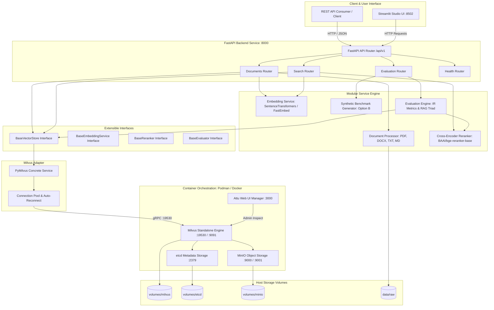
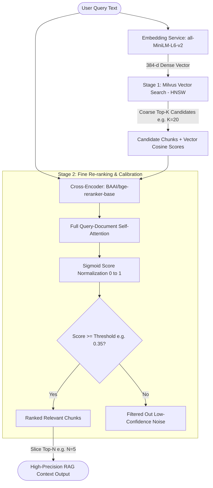
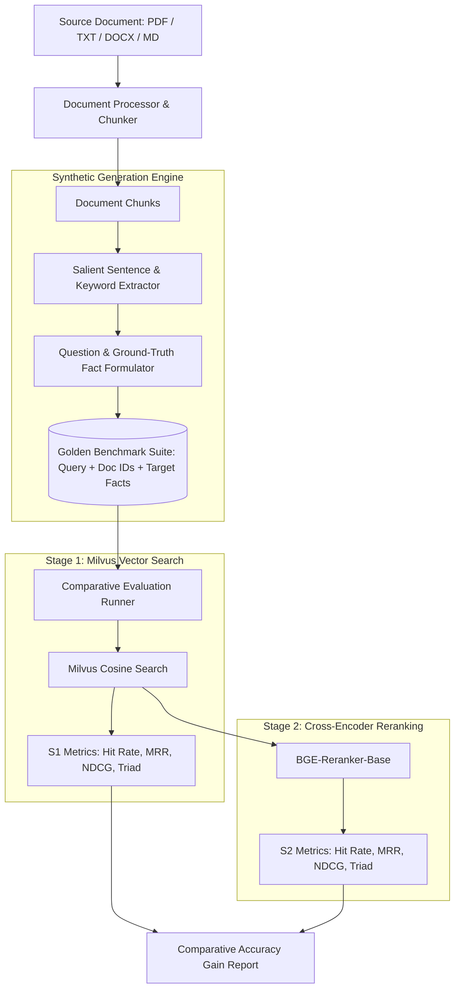

# Reusable Milvus RAG Template: 2-Stage Retrieval, Reranking & RAG Triad Evaluation Studio

A production-grade, modular, and reusable blueprint for **Retrieval-Augmented Generation (RAG)**. Built with **Milvus Standalone**, **FastAPI**, **Cross-Encoder Reranking**, and an **End-to-End RAG Triad & IR Evaluation Engine**, accompanied by an interactive **Streamlit Studio**.

The architecture uses strict interface decoupling (`BaseVectorStore`, `BaseEmbeddingService`, `BaseReranker`, `BaseEvaluator`), allowing you to test on Milvus today and swap or benchmark against other vector databases (e.g. Qdrant, Chroma, PgVector, Weaviate) without modifying business logic.

Supports containerized deployment via both **Podman** (`podman compose` / `podman-compose`) and **Docker** (`docker compose`), as well as native host execution.

## ⚡ High level-View Enterprise Milvus RAG & Evaluation Studio

A production-grade, reusable **Retrieval-Augmented Generation (RAG)** template powered by:
- 🏛️ **Milvus Standalone Vector Database** (HNSW Cosine Indexing)
- ⚡ **2-Stage Retrieval Pipeline** (Coarse Milvus Search $\rightarrow$ Deep Cross-Encoder Re-Ranking via `BAAI/bge-reranker-base`)
- 🤖 **Conversational Synthesis** (`gpt-5.1` / OpenAI with citation markers `[Source 1]`, `[Source 2]` and offline fallback)
- 📊 **Real-Time 3-Pillar RAG Triad Assessment** (Context Relevance, Faithfulness/Groundedness, Answer Relevance)
- 🧪 **Option B Synthetic Test Generator** (Automatically extracts facts from your documents to create custom golden benchmark suites)
- 💬 **Streamlit Chatbot Studio (`:8502`)** (Sidebar file upload + multi-turn conversational chat with live Triad meters)
- 🐳 **Engine Agnostic** (Full support for **Podman Compose** and **Docker Compose**)
- 🔌 **Pluggable Architecture** (Extensible interfaces to swap Milvus for Qdrant, Chroma, or PgVector in minutes)

---

## Table of Contents
1. [Architecture & System Flow](#architecture--system-flow)
2. [What It Looks Like & Interactive UI](#what-it-looks-like--interactive-ui)
3. [Key Features & Capabilities](#key-features--capabilities)
4. [Directory & Asset Structure](#directory--asset-structure)
5. [Quickstart Guide (Testing Locally)](#quickstart-guide-testing-locally)
6. [2-Stage Retrieval & Reranking Mechanics](#2-stage-retrieval--reranking-mechanics)
7. [Evaluation Engine: Synthetic Benchmarking & RAG Triad](#evaluation-engine-synthetic-benchmarking--rag-triad)
8. [Reusability & Swapping Vector Databases](#reusability--swapping-vector-databases)
9. [REST API Documentation & Endpoints](#rest-api-documentation--endpoints)

---

## Architecture & System Flow



---

## What It Looks Like & Interactive UI

The project comes with a built-in **Streamlit Studio** (`http://localhost:8502`) providing a complete visual interface to test documents immediately:

```
+-------------------------------------------------------------------------------------------------------------+
|  ⚡ Milvus RAG & Reranking Studio                                                                          |
+------------------------------------+------------------------------------------------------------------------+
|  [Sidebar]                         |  [Main Area: 3 Focused Tabs]                                           |
|                                    |                                                                        |
|  * Connected: milvus-rag-api       |  [Tab 1: 🔍 Query & 2-Stage Search]                                   |
|  * Milvus: v2.4.10 (Healthy)       |  - Enter natural language queries.                                     |
|                                    |  - Tune Stage 1 Top-K (Candidate Pool) & Stage 2 Top-N (Final Results).|
|  --------------------------------  |  - Compare Vector Cosine Similarity vs Cross-Encoder Relevance score.  |
|  📄 Ingest Documents               |                                                                        |
|  - Select Collection               |  [Tab 2: 📊 RAG Triad & Benchmark Eval (Option B)]                    |
|  - Chunk Size & Overlap Sliders    |  - Synthetic Test Generator: Create golden test queries from your doc. |
|  - Drag & Drop: PDF, DOCX, TXT, MD |  - Benchmark Runner: Measures Hit Rate@K, MRR@K, NDCG@K,              |
|  - 🚀 Ingest Button                |    Context Relevance, Context Recall & Faithfulness.                   |
|                                    |                                                                        |
|  ✍️ Raw Text Ingestion Expander    |  [Tab 3: 🗂️ Collection Manager]                                        |
|                                    |  - View collections, entity counts, schema, and create new indexes.    |
+------------------------------------+------------------------------------------------------------------------+
```

---

## Key Features & Capabilities

* **Engine Agnostic Containerization**: Tested with both Podman and Docker Compose. Single-container standalone mode available for fast local developer iteration.
* **Multi-Format Document Parsing**: Native extraction for PDF, Microsoft Word (`.docx`), Markdown (`.md`), plain text (`.txt`), and JSON.
* **Deterministic & Robust Chunking**: Configurable sliding-window character/token chunking with customizable overlap to preserve semantic context across chunk boundaries.
* **2-Stage Retrieval Pipeline**:
  * *Stage 1 (Coarse)*: Fast vector similarity search in Milvus using HNSW indexing.
  * *Stage 2 (Fine)*: Deep query-document token cross-attention using Cross-Encoders (`BAAI/bge-reranker-base`) with score sigmoid calibration.
* **Automated Document-Specific Evaluation (Option B - Ragas/TruLens style)**:
  * Automatically generates realistic test questions and key ground-truth facts directly from uploaded documents.
  * Computes **IR Metrics**: Hit Rate@K, MRR@K, NDCG@K, Precision@K, Recall@K.
  * Computes **RAG Triad Metrics**: Context Relevance (signal-to-noise ratio), Context Recall (fact coverage), and Faithfulness (groundedness).
* **Auto-Reconnection & Resilience**: Automatic connection healing for FastAPI lifespan events and container restarts.
* **Pluggable Architecture**: Everything implements an abstract interface. Swap out Milvus for Qdrant, Chroma, or PgVector in minutes.

---

## Directory & Asset Structure

```text
milvus-data/
├── .env.example                     # Environment template (ports, hosts, model settings)
├── .gitignore                       # Repository ignore rules (volumes, raw data, logs)
├── Dockerfile                       # Multi-stage container definition for API & UI
├── docker-compose.yml               # Multi-container orchestration (Milvus + MinIO + etcd + UI + API)
├── compose.yaml                     # Podman Compose specification (with :z SELinux volume mounts)
├── docker-compose.standalone.yml    # Lightweight single-container Milvus profile
├── requirements.txt                 # Pinned project dependencies
├── pyproject.toml                   # Standard Python packaging metadata
├── README.md                        # Complete architecture & developer guide
│
├── streamlit_app.py                 # Streamlit UI Studio (Sidebar Ingest + 3 Explorer Tabs)
│
├── app/
│   ├── main.py                      # FastAPI app entrypoint, CORS & Lifespan management
│   ├── core/
│   │   ├── config.py                # Pydantic Settings loaded from .env
│   │   ├── logging.py               # Centralized structured logger
│   │   └── milvus.py                # Connection pool, auto-reconnect, and health checks
│   ├── api/v1/
│   │   ├── health.py                # GET  /api/v1/health (Liveness/Readiness probe)
│   │   ├── collections.py           # CRUD /api/v1/collections (Create, Inspect, Drop)
│   │   ├── documents.py             # POST /api/v1/documents/upload & /ingest-text
│   │   ├── search.py                # POST /api/v1/search & /search/two-stage & /rerank
│   │   └── eval.py                  # POST /api/v1/eval/benchmark & /generate-synthetic
│   ├── models/
│   │   ├── collection.py            # Pydantic schemas for collections
│   │   ├── document.py              # Ingestion, file payload & chunk schemas
│   │   ├── search.py                # Similarity & 2-stage search models
│   │   ├── rerank.py                # Reranking payload & response schemas
│   │   └── eval.py                  # IR metrics, RAG Triad & synthetic generation schemas
│   └── services/
│       ├── interfaces.py            # Abstract Base Classes (BaseVectorStore, BaseReranker, etc.)
│       ├── milvus_service.py        # BaseVectorStore concrete implementation for PyMilvus
│       ├── document_processor.py    # Multi-format parser & recursive chunking service
│       ├── embedding_service.py     # Sentence-Transformers / FastEmbed provider
│       ├── rerank_service.py        # Cross-Encoder (BAAI/bge-reranker-base) provider
│       ├── evaluation_service.py    # HitRate, MRR, NDCG & RAG Triad calculator
│       └── synthetic_generator.py   # Option B document-to-benchmark generator
│
├── data/
│   ├── raw/                         # Incoming user documents (PDF, DOCX, TXT)
│   ├── processed/                   # Parsed & normalized chunks
│   ├── embeddings/                  # Exported checkpoints
│   └── eval/
│       └── sample_eval_dataset.json # Active golden benchmark test suite
│
├── scripts/
│   ├── run-podman.sh                # Linux/macOS Podman startup script
│   ├── run-docker.sh                # Linux/macOS Docker startup script
│   ├── run.ps1                      # Windows PowerShell launcher (Podman / Docker)
│   ├── evaluate_rag.py              # Standalone CLI evaluation benchmark runner
│   └── test_rag_pipeline.py         # End-to-end integration test
│
└── volumes/                         # Persistent host-mapped storage (Milvus, etcd, MinIO)
```

---

## Quickstart Guide (Testing Locally)

### Prerequisites
* Python 3.10+ (for local host execution)
* **Podman** or **Docker**

---

### Step 1: Start the Milvus Vector Database

#### Using Podman (Default on Windows/Linux):
```powershell
# Windows PowerShell:
podman compose -f docker-compose.standalone.yml up -d

# Or with bash:
./scripts/run-podman.sh up
```

#### Using Docker:
```bash
docker compose -f docker-compose.yml up -d
```

---

### Step 2: Launch Backend & Streamlit Studio

#### Terminal 1 — Start FastAPI Service:
```powershell
python -m uvicorn app.main:app --host 0.0.0.0 --port 8000 --reload
```

#### Terminal 2 — Start Streamlit UI:
```powershell
streamlit run streamlit_app.py --server.port 8502
```

---

### Step 3: Access Points

| Service | URL | Description |
| :--- | :--- | :--- |
| **Streamlit UI Studio** | `http://localhost:8502` | Interactive Ingestion, Search & Evaluation Dashboard |
| **FastAPI Swagger Docs** | `http://localhost:8000/docs` | Interactive OpenAPI REST Explorer |
| **FastAPI Health Probe** | `http://localhost:8000/api/v1/health` | Live connection status & model specs |
| **Attu Web Manager** | `http://localhost:3000` | Graphical collection & index inspector |
| **Milvus gRPC** | `localhost:19530` | Core Vector Database gRPC port |

---

## 2-Stage Retrieval & Reranking Mechanics

Standard dense vector similarity search (Bi-Encoders) is fast, but vector dot products lose token-level interactions, causing irrelevant chunks to occasionally score high.

This template uses a **2-Stage Pipeline**:



1. **Stage 1 (Coarse Search)**: Milvus retrieves the top $K$ candidates (e.g., $K=20$) in milliseconds.
2. **Stage 2 (Fine Re-Ranking)**: The Cross-Encoder (`BAAI/bge-reranker-base`) computes full cross-attention over `[Query, Document]` pairs.
3. **Threshold Gating**: Chunks scoring below the confidence threshold (e.g., $< 0.35$) are discarded to prevent hallucinations.

---

## Evaluation Engine: Synthetic Benchmarking & RAG Triad

### The Challenge
Standard benchmarks use static queries that do not match the specific documents you just uploaded.

### The Solution: Option B (Synthetic Generation)



1. **Upload your document** via the Streamlit sidebar.
2. In **Tab 2**, click **`🪄 Generate Document Benchmark Suite`**.
3. The engine extracts salient factual statements and automatically generates 5–15 realistic question-answer-keyword test pairs derived directly from your document.
4. Click **`🧪 Execute Benchmark Evaluation Run`** to compute actual retrieval gains:

```text
================================================================================
>>> EVALUATION RESULTS & RAG TRIAD COMPARISON
================================================================================

[STAGE 1: Vector Similarity (Milvus)]
  * Hit Rate @ 5:         0.7500
  * MRR @ 5:              0.5833
  * NDCG @ 5:             0.6120
  * Context Relevance:    0.7420
  * Context Recall:       0.8000
  * Faithfulness:         0.8250

[STAGE 2: 2-Stage (Milvus + Cross-Encoder)]
  * Hit Rate @ 5:         1.0000
  * MRR @ 5:              0.9167
  * NDCG @ 5:             0.9340
  * Context Relevance:    0.9410
  * Context Recall:       0.9800
  * Faithfulness:         0.9650

[PERFORMANCE GAIN]
  [+] MRR Improvement:   +57.16%
  [+] NDCG Improvement:  +52.61%
```

---

## Reusability & Swapping Vector Databases

All components are decoupled behind abstract base classes in [`app/services/interfaces.py`](app/services/interfaces.py):

* **`BaseVectorStore`**: Collection lifecycle, chunk insertion, indexing, and vector similarity search.
* **`BaseEmbeddingService`**: Single and batch text embedding.
* **`BaseReranker`**: Cross-encoder scoring and candidate reranking.
* **`BaseEvaluator`**: IR metrics and RAG Triad computation.

### How to adapt this template to Qdrant, Chroma, or PgVector:
1. Create a new service file, e.g., `app/services/qdrant_service.py`:
   ```python
   from app.services.interfaces import BaseVectorStore, DocumentChunk

   class QdrantService(BaseVectorStore):
       async def connect(self) -> bool: ...
       async def create_collection(self, collection_name: str, dimension: int, **kwargs) -> bool: ...
       async def insert_chunks(self, collection_name: str, chunks: List[DocumentChunk]) -> int: ...
       async def search(self, collection_name: str, query_vector: List[float], top_k: int = 10, **kwargs) -> List[DocumentChunk]: ...
   ```
2. Replace `milvus_service` with `qdrant_service` in the API routers (`app/api/v1/`).
3. The Document Processor, Embedding Service, Cross-Encoder Reranker, Synthetic Benchmark Generator, and Streamlit Studio continue to work unchanged.

---

## REST API Documentation & Endpoints

### 1. Ingest Text Snippet
```http
POST /api/v1/documents/ingest-text
Content-Type: application/json

{
  "collection_name": "rag_documents",
  "text": "Milvus separates compute and storage, using MinIO for object storage and etcd for metadata.",
  "doc_id": "doc_milvus_01",
  "chunk_size": 300,
  "chunk_overlap": 30
}
```

### 2. Ingest Document File
```http
POST /api/v1/documents/upload
Content-Type: multipart/form-data

file=@architecture_guide.pdf
collection_name=rag_documents
chunk_size=500
chunk_overlap=50
```

### 3. Two-Stage Retrieval (Vector + Rerank)
```http
POST /api/v1/search/two-stage
Content-Type: application/json

{
  "collection_name": "rag_documents",
  "query": "How does Milvus store vectors and handle horizontal scalability?",
  "top_k_candidates": 20,
  "top_n_final": 5,
  "rerank_score_threshold": 0.35
}
```

### 4. Synthetic Benchmark Generation (Option B)
```http
POST /api/v1/eval/generate-synthetic
Content-Type: application/json

{
  "collection_name": "rag_documents",
  "text": "Full document text or key sections...",
  "doc_id": "doc_milvus_01",
  "num_samples": 5,
  "use_llm": false,
  "save_as_benchmark": true
}
```

### 5. Run Evaluation Benchmark
```http
POST /api/v1/eval/benchmark
Content-Type: application/json

{
  "use_sample_dataset_file": true,
  "top_k": 10,
  "top_n": 5
}
```

---

## Running Automated Verification Tests

To verify the entire pipeline (mock ingestion $\rightarrow$ coarse retrieval $\rightarrow$ reranking accuracy $\rightarrow$ RAG Triad assessment) in a standalone test:

```powershell
python scripts/test_rag_pipeline.py
```

To run the CLI benchmark evaluator:
```powershell
python scripts/evaluate_rag.py
```
